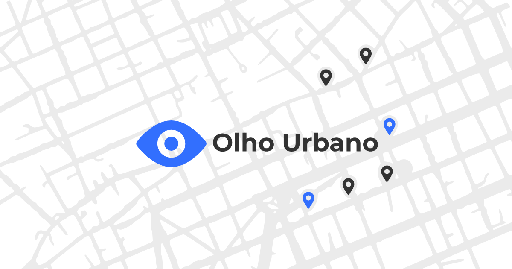

# Olho Urbano

  
    
  
  **🔍 Plataforma de Tecnologia Cívica Open Source**
  
  
  
  

## 🌟 Sobre o Olho Urbano

**Olho Urbano** é uma plataforma de tecnologia cívica que conecta cidadãos com seus governos locais para reportar e resolver problemas urbanos. Nossa missão é tornar as cidades mais transparentes, responsivas e amigáveis aos cidadãos através da tecnologia.

**Plataforma Ativa**: [https://olhourbano.com.br](https://olhourbano.com.br)

## 🔍 Transparência e Segurança

Este repositório está **aberto para inspeção** para demonstrar nosso compromisso com:

- **🔒 Transparência de Segurança**: Todo o código está visível para auditoria de segurança
- **🛡️ Proteção de Privacidade**: Práticas transparentes de manipulação de dados
- **🏛️ Governo Aberto**: Transparência em tecnologia cívica
- **🤝 Construção de Confiança**: Verificação pública de nossas práticas

## 📋 Licença e Uso

### ✅ Usos Permitidos
- **Auditoria de Segurança**: Revisar código para vulnerabilidades e práticas de segurança
- **Verificação de Transparência**: Verificar nossas práticas de manipulação de dados e privacidade
- **Fins Educacionais**: Aprender com nossa implementação de tecnologia cívica
- **Relatórios de Bugs**: Contribuir com descobertas de segurança e relatórios de bugs

### ❌ Usos Restritos
- **Cópia/Redistribuição**: Este código não pode ser copiado ou redistribuído
- **Trabalhos Derivados**: Criar versões modificadas não é permitido
- **Uso Comercial**: Implantação comercial requer permissão explícita
- **Implantação Não Autorizada**: Executar este software requer consentimento por escrito

**Licença**: [Licença de Transparência](LICENSE) - Visualizar para transparência, restrito para cópia

## 🏗️ Visão Geral da Arquitetura

### Stack Tecnológico
- **Backend**: Go (Golang) com framework web customizado
- **Banco de Dados**: PostgreSQL com sistema de migração customizado
- **Frontend**: HTML5, CSS3, JavaScript (Vanilla)
- **Infraestrutura**: Docker, Caddy (proxy reverso)
- **Segurança**: Gerenciamento customizado de segredos, aplicação de HTTPS

### Principais Recursos
- **🔐 Verificação Segura de CPF**: Integração com validação oficial de CPF brasileiro
- **🗺️ Mapas Interativos**: Integração com Google Maps para relatórios baseados em localização
- **📱 Design Mobile-First**: Interface responsiva para todos os dispositivos
- **📊 Estatísticas em Tempo Real**: Análises de relatórios e votação ao vivo
- **🔄 Processamento de Arquivos**: Suporte para imagens, vídeos, PDFs com limpeza de metadados
- **💬 Recursos Comunitários**: Sistema de comentários e votação

## 🚀 Começando (Apenas Desenvolvimento)

### Pré-requisitos
- Go 1.24.4+
- PostgreSQL 15+
- Docker & Docker Compose
- ImageMagick (para processamento de arquivos)

### Configuração do Ambiente
Veja [DEPLOYMENT.md](DEPLOYMENT.md) para instruções detalhadas de configuração.

## 📚 Documentação

- **[Documentação de Segurança](SECURITY.md)**: Medidas abrangentes de segurança e procedimentos de auditoria
- **[Guia de Implantação](DEPLOYMENT.md)**: Instruções de implantação em produção
- **[Esquema do Banco de Dados](db/README.md)**: Estrutura do banco de dados e sistema de migração
- **[Documentação da API](handlers/)**: Handlers e endpoints da API backend

## 🔧 Componentes Principais

### Módulos Principais
- **`handlers/`**: Handlers de requisições HTTP e endpoints da API
- **`services/`**: Lógica de negócio e integrações com serviços externos
- **`models/`**: Estruturas de dados e modelos do banco de dados
- **`config/`**: Gerenciamento de configuração e categorias
- **`db/`**: Conexão com banco de dados e sistema de migração

### Recursos de Segurança
- **Gerenciamento de Segredos**: Segredos baseados em arquivo com integração Docker
- **Verificação de CPF**: API oficial de validação de CPF brasileiro
- **Segurança de Arquivos**: Limpeza de metadados e escaneamento de vírus
- **Aplicação de HTTPS**: SSL/TLS com headers de segurança
- **Validação de Entrada**: Validação abrangente de formulários

## 🌍 Impacto da Tecnologia Cívica

O Olho Urbano demonstra como a tecnologia cívica pode:

- **Empoderar Cidadãos**: Fornecer canais fáceis para relatar problemas urbanos
- **Melhorar a Transparência**: Visibilidade pública das respostas governamentais
- **Aumentar a Responsabilidade**: Acompanhar resolução de problemas e tempos de resposta
- **Fomentar a Comunidade**: Permitir colaboração cidadã e votação

## 🤝 Contribuindo

### Segurança e Relatórios de Bugs
Acolhemos descobertas de segurança e relatórios de bugs:
- **Problemas de Segurança**: Reporte via email para olhourbano.contato@gmail.com
- **Relatórios de Bugs**: Use GitHub Issues para bugs não relacionados à segurança
- **Documentação**: Sugira melhorias em nossa documentação

### Contribuições de Código
Devido ao nosso modelo de licenciamento, não podemos aceitar contribuições diretas de código. No entanto, acolhemos:
- **Auditorias de Segurança**: Revisões independentes de segurança
- **Sugestões de Recursos**: Ideias para melhorias da plataforma
- **Documentação**: Ajude a melhorar nossa documentação de transparência

## 📞 Contato e Suporte

- **Email**: olhourbano.contato@gmail.com
- **Website**: [https://olhourbano.com.br](https://olhourbano.com.br)
- **Plataforma Ativa**: [https://olhourbano.com.br](https://olhourbano.com.br)

## 📄 Legal

Este software é fornecido sob a [Licença de Transparência](LICENSE). 
Para consultas sobre licenciamento ou solicitações de uso comercial, entre em contato: olhourbano.contato@gmail.com

---

**Olho Urbano** - Construindo cidades transparentes e responsivas através da tecnologia cívica.

*"A transparência constrói confiança. A confiança constrói cidades melhores."*
